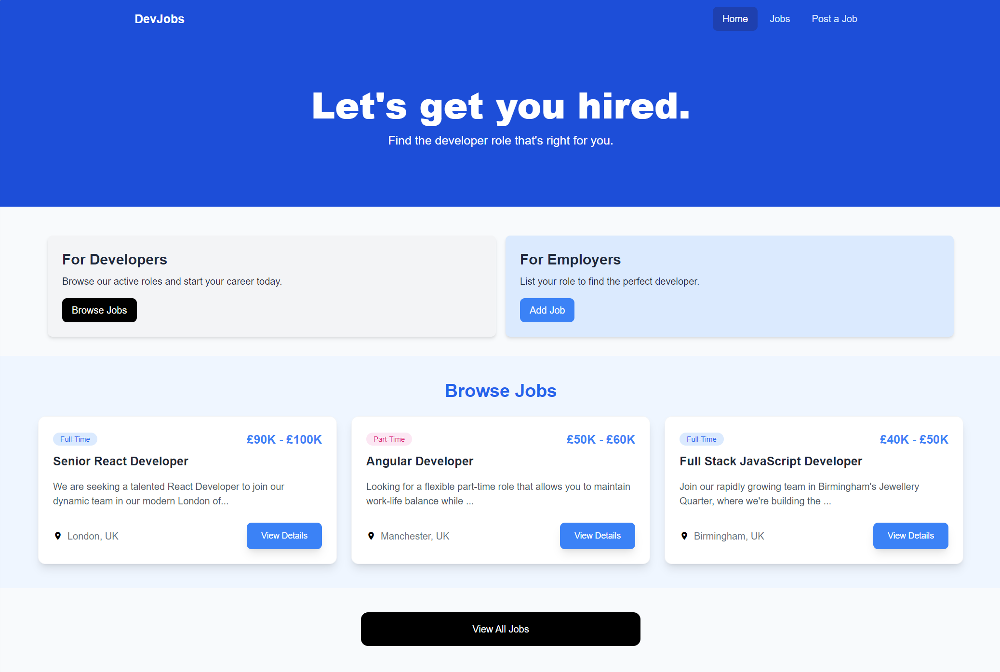

# DevJobs

A modern and responsive job board application built with Vue.js, specifically designed for companies to post developer positions and for developers to find their next role. This project demonstrates proficiency in modern Vue.js development practices, state management and responsive design.



## 🚀 Features

- **Complete CRUD Operations:**
  - Create new job listings
  - Read and browse job details
  - Update existing job postings
  - Delete unwanted listings
- **Job Listings:** Browse and search through developer positions
- **Job Details:** Detailed view of each job posting with company information
- **Job Management:** Create, edit and delete job listings
- **Responsive Design:** Fully responsive layout that works on all devices
- **Real-time Feedback:** Toast notifications for user actions
- **Loading States:** Elegant loading animations during data fetching

## 🛠️ Technologies Used

- **Vue.js 3:** Latest version with Composition API
- **Vue Router:** For client-side routing
- **Tailwind CSS:** For modern, utility-first styling
- **JSON Server:** For rapid backend prototyping
- **Vue Toastification:** For user notifications
- **Vue Spinner:** For loading states
- **Vite:** For fast development and building

## 📋 Prerequisites

Before you begin, ensure you have the following installed:

- Node.js (v14.0.0 or higher)
- npm (v6.0.0 or higher)

## 🚀 Getting Started

1. **Clone the repository**

   ```bash
   git clone https://github.com/connorhanks/devjobs.git
   cd devjobs
   ```

2. **Install dependencies**

   ```bash
   npm install
   ```

3. **Start the mock backend server**

   ```bash
   npm run server
   ```

   This will start the JSON server on port 5000

4. **Start the development server**
   ```bash
   npm run dev
   ```
   The application will be available at `http://localhost:3000`

## 🎯 Key Features Demonstrated

- **Component Composition:** Efficient use of Vue.js components for modularity and reusability
- **State Management:** Reactive state handling using Vue's Composition API
- **API Integration:** Asynchronous data fetching with error handling
- **Form Handling:** Complex form implementations with validation
- **Responsive Design:** Mobile-first approach using Tailwind CSS
- **User Experience:** Loading states, notifications and smooth transitions

## 🔧 Development

The project uses several modern development tools and practices:

- **Vite** for blazing-fast development and building
- **ESLint** for code quality
- **Tailwind CSS** for utility-first styling
- **Vue Router** for client-side routing

## 🚀 Deployment

To build the project for production:

```bash
npm run build
```

This will generate a `dist` directory with production-ready files.

## 🤝 Contributing

Contributions are welcome! Please feel free to submit a Pull Request.

## 📝 License

This project is licensed under the MIT License - see the LICENSE file for details.

## 🙋‍♂️ Contact

Email - [hello@connorhanks.com](mailto:hello@connorhanks.com)
